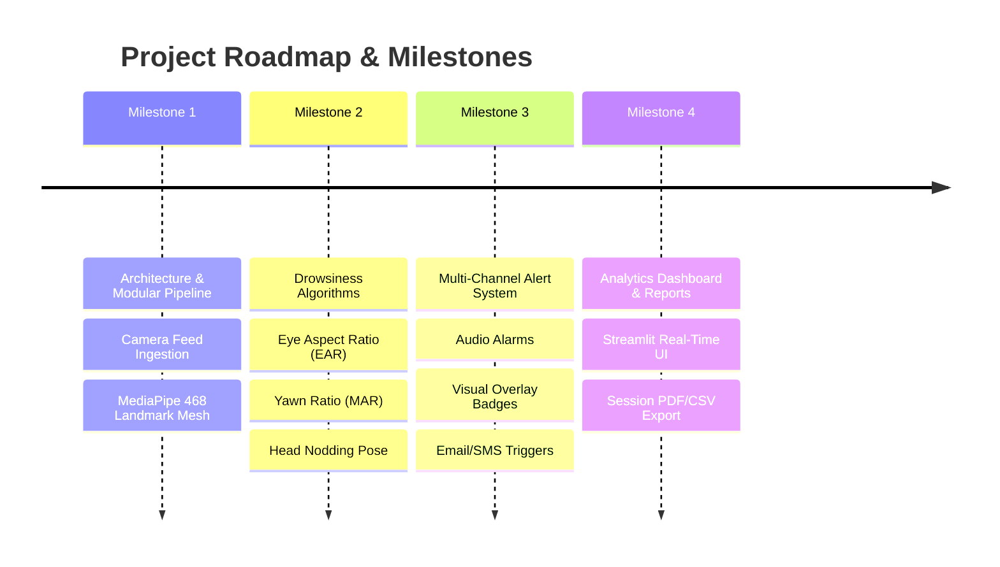

# 👁️ Student Drowsiness Detection System

[](https://www.python.org/)
[](https://opencv.org/)
[](https://developers.google.com/mediapipe)
[](LICENSE)

An enterprise-grade, production-ready AI computer vision application designed for monitoring student alertness and detecting drowsiness during online classes or physical classrooms. 

Built with a scalable, modular architecture separating video ingestion, facial landmark detection, alerting, UI dashboarding, and session analytics.

---

## 📂 Project Structure

```text
Student-Drowsiness-Detection/
├── .gitignore          # Production Python gitignore rules
├── README.md           # Master project documentation
├── requirements.txt    # Project dependency specifications
├── config.py           # Central single source of truth for settings & thresholds
├── main.py             # Main application entry point & event loop
├── camera/             # Video stream capture & frame ingestion module
│   ├── __init__.py
│   └── camera.py       # CameraStream class (FPS calculation, device checks)
├── detection/          # AI & Computer Vision algorithms package
│   ├── __init__.py
│   └── face_mesh.py    # MediaPipe FaceMeshDetector (468 3D landmark extractor)
├── alerts/             # Multi-channel alert subsystem (Audio/Visual)
│   └── __init__.py
├── dashboard/          # Real-time Streamlit web dashboard
│   └── __init__.py
├── reports/            # Analytics engine & session logging reports
│   └── __init__.py
├── utils/              # Helper utilities & logging infrastructure
│   ├── __init__.py
│   └── logger.py       # Centralized rotating file & console logger
├── tests/              # Unit and integration test suite
│   └── __init__.py
├── assets/             # Media files, sound clips, & pre-trained weights
│   └── .gitkeep
├── datasets/           # Raw & processed training datasets
│   └── .gitkeep
├── docs/               # Architecture design & milestone documentation
│   ├── .gitkeep
│   └── milestone_1.md  # Milestone 1 summary report
└── output/             # Runtime logs, video recordings, & exported reports
    ├── logs/
    ├── recordings/
    └── reports/
```

---

## 🛠️ Python Installation & Virtual Environment Setup

### Recommended Python Version
* **Python 3.10.x** or **Python 3.11.x** (64-bit)
  * *Rationale*: Full pre-compiled wheel compatibility for `mediapipe` and `opencv-python` on Windows without requiring C++ build toolchains.

### Step-by-Step Installation

#### 1. Clone Repository & Navigate
```powershell
git clone https://github.com/MahaManisha/Student-Drowsiness-Detection.git
cd Student-Drowsiness-Detection
```

#### 2. Create Virtual Environment
```powershell
python -m venv .venv
```

#### 3. Activate Virtual Environment (Windows)

- **PowerShell**:
  ```powershell
  .\.venv\Scripts\Activate.ps1
  ```
- **Command Prompt (`cmd.exe`)**:
  ```cmd
  .\.venv\Scripts\activate.bat
  ```
- **Git Bash**:
  ```bash
  source .venv/Scripts/activate
  ```

#### 4. Install Dependencies
```powershell
python -m pip install --upgrade pip
pip install -r requirements.txt
```

---

## 📦 Dependency Breakdown

| Package | Version | Purpose & Rationale |
| :--- | :--- | :--- |
| **`opencv-python`** | `>=4.8.0` | Handles webcam feed capture, frame decoding, color space conversions, overlay rendering, and window display. |
| **`mediapipe`** | `>=0.10.9` | High-precision, real-time 3D facial mesh detector extracting 468 landmark points per face. |
| **`numpy`** | `>=1.24.0,<2.0.0` | Matrix computations and Euclidean distance calculations between facial landmark coordinates. |
| **`scipy`** | `>=1.10.0` | Scientific computing library for convex hull and signal smoothing algorithms. |
| **`pandas`** | `>=2.0.0` | Data processing library for building student session logs and exportable reports. |
| **`matplotlib`** | `>=3.7.0` | Data visualization library for session fatigue curves and analytical charts. |
| **`streamlit`** | `>=1.28.0` | Framework for building real-time monitoring web user interfaces. |
| **`pygame` / `playsound`** | `>=2.5.0` | Cross-platform audio playback engines for asynchronous alarm triggers. |
| **`pytest`** | `>=7.4.0` | Test runner framework for unit and integration testing. |

---

## 🚀 How to Run the Application

Execute the main application driver:

```powershell
python main.py
```

* **Keyboard Controls**: Press `q` or `ESC` inside the video preview window to stop the stream cleanly.
* **Logs Output**: Check `output/logs/system.log` to view real-time execution logs.

---

## 📌 Current Project Status (Milestone 1 Complete)

- [x] **Project Architecture Setup**: Created clean folder structure separating concerns.
- [x] **Configuration Module (`config.py`)**: Built central single source of truth for camera IDs, resolution, thresholds, and file paths.
- [x] **Logging Subsystem (`utils/logger.py`)**: Implemented thread-safe, dual-handler logger with 5MB file rotation.
- [x] **Camera Stream Module (`camera/camera.py`)**: Built `CameraStream` OOP class with availability checking, resolution scaling, real-time FPS overlay, and context manager support.
- [x] **MediaPipe Face Mesh Integration (`detection/face_mesh.py`)**: Integrated 468-point 3D face mesh landmark extraction and visual grid rendering.
- [x] **Main Driver Application (`main.py`)**: Connected all core modules into a real-time event loop with keyboard interrupt handling.

---

## 🔮 Future Milestones



### 🎯 Milestone 2: Drowsiness Detection Algorithms (Upcoming)
- Implement **Eye Aspect Ratio (EAR)** calculation to detect closed eyes.
- Implement **Mouth Aspect Ratio (MAR)** calculation for yawn tracking.
- Implement **Head Pose Estimation** (Pitch/Yaw/Roll) for head nodding detection.
- Implement consecutive frame threshold counters to avoid false alarms from natural blinks.

### 🎯 Milestone 3: Multi-Channel Alert Subsystem
- Trigger asynchronous audio alarms on critical drowsiness detection.
- Render dynamic alert banner overlays on camera feed.

### 🎯 Milestone 4: Streamlit Dashboard & Session Reporting
- Launch live web dashboard for monitoring multiple students.
- Automated session analytics export (CSV/PDF reports).

---

## 📄 License
This project is licensed under the MIT License.
