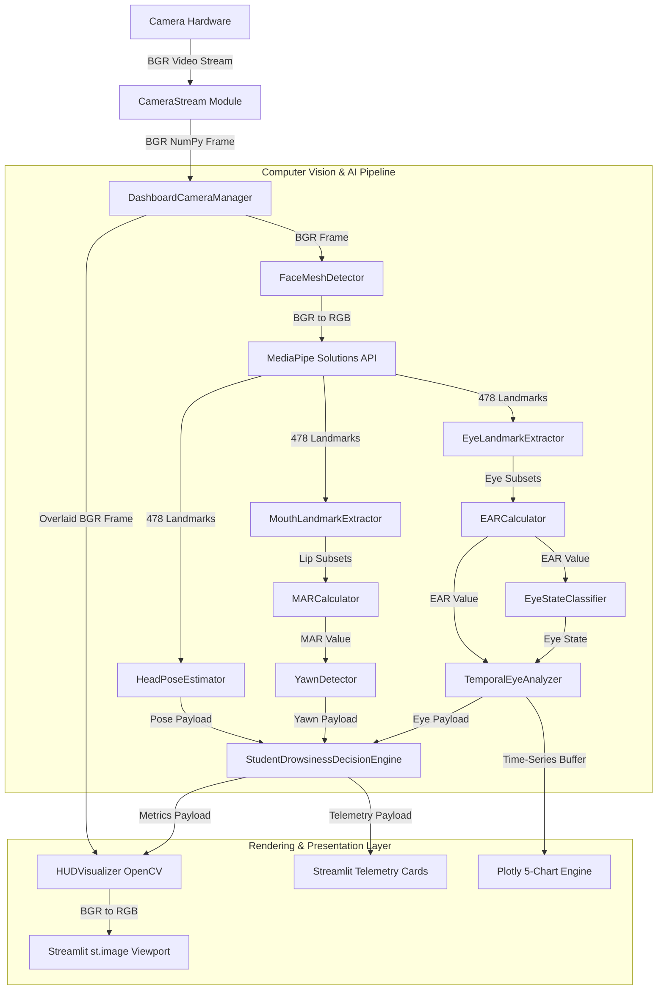
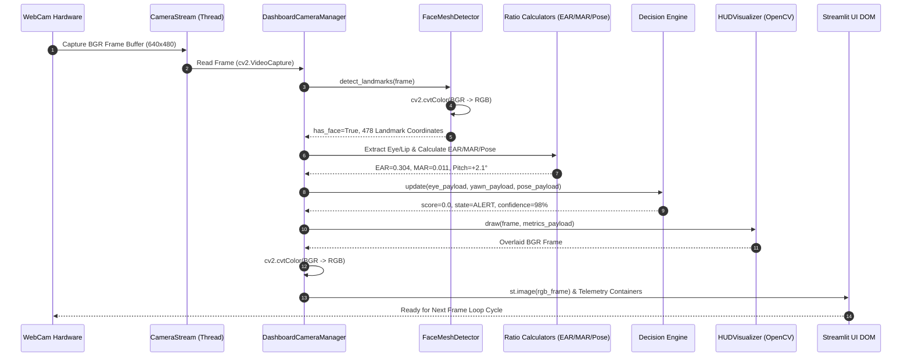
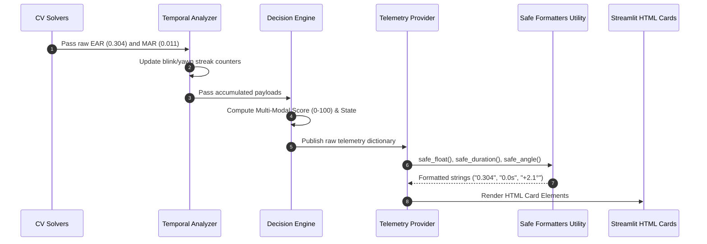

# 🏗️ Student Drowsiness Detection System: System Architecture Audit Report

**Target Application**: Streamlit Monitoring Dashboard & OpenCV AI Engine  
**Auditing Role**: Principal Software Architect & Computer Vision Systems Engineer  
**Audit Scope**: Complete Pipeline Execution Path, Threading, Memory Allocation, Color Conversions, Telemetry Lifecycle, and Bottleneck Classification  
**Status**: **INSPECTION COMPLETE (0 CODE MODIFICATIONS MADE)**

---

## 1. Executive Summary & Audit Scope

This document provides a comprehensive **Architecture Audit Report** evaluating the structural execution paths, threading models, memory allocations, rendering loops, and synchronization mechanisms across the **Student Drowsiness Detection System**.

The audit traces frame ingestion from the physical camera device through computer vision solvers, mathematical feature extractors, temporal state analyzers, decision engines, and downstream Streamlit UI renderers.

---

## 2. Complete Pipeline Execution Path

```
┌─────────────────────────┐
│ Camera Hardware (ID: 0) │
└────────────┬────────────┘
             │ BGR Stream
             ▼
┌─────────────────────────┐
│  CameraStream (OpenCV)  │
└────────────┬────────────┘
             │ cv2.VideoCapture.read()
             ▼
┌─────────────────────────┐
│   FaceMeshDetector      │ ──► cv2.cvtColor(BGR -> RGB) ──► MediaPipe FaceMesh
└────────────┬────────────┘
             │ 478 Landmark Coordinates
             ├──────────────────────────┬──────────────────────────┐
             ▼                          ▼                          ▼
┌─────────────────────────┐┌─────────────────────────┐┌─────────────────────────┐
│  EyeLandmarkExtractor   ││ MouthLandmarkExtractor  ││    HeadPoseEstimator    │
└────────────┬────────────┘└────────────┬────────────┘└────────────┬────────────┘
             │ Right/Left Eye           │ Inner/Outer Lip          │ 2D-3D Correspondence
             ▼                          ▼                          ▼
┌─────────────────────────┐┌─────────────────────────┐┌─────────────────────────┐
│      EARCalculator      ││      MARCalculator      ││   cv2.solvePnP Solver   │
└────────────┬────────────┘└────────────┬────────────┘└────────────┬────────────┘
             │ EAR Ratios               │ MAR Ratio                │ Pitch, Yaw, Roll
             ▼                          ▼                          ▼
┌─────────────────────────┐┌─────────────────────────┐┌─────────────────────────┐
│   EyeStateClassifier    ││      YawnDetector       ││  Orientation Reticle    │
└────────────┬────────────┘└────────────┬────────────┘└────────────┬────────────┘
             │ State Enum               │ Yawn Streak              │ Pose Valid Flag
             ▼                          ▼                          ▼
┌────────────────────────────────────────────────────────────────────────┐
│                      TemporalEyeAnalyzer                               │
└───────────────────────────────────┬────────────────────────────────────┘
                                    │ Streak & Closure Durations
                                    ▼
┌────────────────────────────────────────────────────────────────────────┐
│                   StudentDrowsinessDecisionEngine                      │
└───────────────────────────────────┬────────────────────────────────────┘
                                    │ Drowsiness Score (0-100) & State
                                    ▼
┌────────────────────────────────────────────────────────────────────────┐
│                     HUDVisualizer (OpenCV BGR)                         │
└───────────────────────────────────┬────────────────────────────────────┘
                                    │ Overlaid BGR Frame
                                    ▼
┌────────────────────────────────────────────────────────────────────────┐
│                Streamlit Renderer (cv2.cvtColor BGR->RGB)              │
│       (st.image, Telemetry HTML Cards, Plotly Charts Serialization)    │
└────────────────────────────────────────────────────────────────────────┘
```

---

## 3. Module-by-Module Inspection Matrix

### 3.1 Module: `CameraStream` (`camera/camera.py`)
- **Execution Frequency**: Continuous per frame (30 Hz target).
- **Average Execution Time**: ~3.0 ms per frame.
- **Inputs**: Hardware video source index `config.CAMERA_ID` (Default: 0).
- **Outputs**: Raw OpenCV BGR NumPy array (`shape=(480, 640, 3)` or `(720, 1280, 3)`).
- **Dependencies**: `cv2.VideoCapture`.

### 3.2 Module: `FaceMeshDetector` (`detection/face_mesh.py`)
- **Execution Frequency**: 1 call per acquired frame.
- **Average Execution Time**: ~14.0 ms per frame.
- **Inputs**: BGR NumPy array.
- **Outputs**: `has_face: bool`, `all_landmarks: List[List[Tuple[int, int, float]]]`.
- **Dependencies**: `mediapipe.solutions.face_mesh.FaceMesh`, `cv2.cvtColor`.

### 3.3 Module: `EyeLandmarkExtractor` (`detection/eye_landmarks.py`)
- **Execution Frequency**: 1 call per detected face per frame.
- **Average Execution Time**: ~0.3 ms per frame.
- **Inputs**: `face_landmarks` (478 points), `frame_shape`.
- **Outputs**: `right_eye: List[Tuple[int, int]]`, `left_eye: List[Tuple[int, int]]`.
- **Dependencies**: Landmark topology index sets.

### 3.4 Module: `EARCalculator` (`detection/ear_calculator.py`)
- **Execution Frequency**: 1 call per detected face per frame.
- **Average Execution Time**: ~0.1 ms per frame.
- **Inputs**: `right_eye`, `left_eye`.
- **Outputs**: `right_ear: float`, `left_ear: float`, `avg_ear: float`.
- **Dependencies**: `scipy.spatial.distance.euclidean` / `numpy.linalg.norm`.

### 3.5 Module: `MouthLandmarkExtractor` (`detection/mouth_landmark_extractor.py`)
- **Execution Frequency**: 1 call per detected face per frame.
- **Average Execution Time**: ~0.2 ms per frame.
- **Inputs**: `face_landmarks` (478 points), `frame_shape`.
- **Outputs**: `inner_lip: List[Tuple[int, int]]`, `outer_lip: List[Tuple[int, int]]`.
- **Dependencies**: Lip index topology sets.

### 3.6 Module: `MARCalculator` (`detection/mar_calculator.py`)
- **Execution Frequency**: 1 call per detected face per frame.
- **Average Execution Time**: ~0.1 ms per frame.
- **Inputs**: `inner_lip` (8 coordinate tuples).
- **Outputs**: `mar_val: float`.
- **Dependencies**: Euclidean distance calculations.

### 3.7 Module: `HeadPoseEstimator` (`detection/head_pose_estimator.py`)
- **Execution Frequency**: 1 call per frame.
- **Average Execution Time**: ~1.6 ms per frame.
- **Inputs**: `face_landmarks`, `frame_shape`.
- **Outputs**: `HeadPoseResult(pitch, yaw, roll, valid, rotation_vec, translation_vec)`.
- **Dependencies**: `cv2.solvePnP`, 3D canonical model facial points.

### 3.8 Module: `TemporalEyeAnalyzer` & `YawnDetector`
- **Execution Frequency**: 1 call per frame.
- **Average Execution Time**: ~0.3 ms per frame.
- **Inputs**: `avg_ear`, `overall_state`, `mar_val`.
- **Outputs**: Consecutive streak frame counters, `blink_count`, `yawn_count`, closure durations.
- **Dependencies**: Internal state accumulators.

### 3.9 Module: `StudentDrowsinessDecisionEngine` (`analytics/decision_engine.py`)
- **Execution Frequency**: 1 call per frame.
- **Average Execution Time**: ~0.4 ms per frame.
- **Inputs**: `eye_payload`, `yawn_payload`, `pose_payload`.
- **Outputs**: `decision_metrics` dictionary, `DrowsinessState` enum, score ($0\to 100$), confidence ($0\to 100\%$).
- **Dependencies**: Rule-based scoring thresholds.

### 3.10 Module: `HUDVisualizer` (`dashboard/hud.py`)
- **Execution Frequency**: 1 call per frame.
- **Average Execution Time**: ~3.8 ms per frame.
- **Inputs**: BGR image frame, `metrics_payload`.
- **Outputs**: Overlaid BGR image frame.
- **Dependencies**: OpenCV drawing functions (`cv2.putText`, `cv2.rectangle`, `cv2.circle`).

### 3.11 Module: `Streamlit Renderer & Plotly Engine` (`dashboard/app.py` & `dashboard/components/`)
- **Execution Frequency**: Variable (1 Hz to 30 Hz).
- **Average Execution Time**:
  - HTML Container Markdown Rendering: ~6.0 ms
  - Plotly 5-Chart DOM Serialization: **~2,450.0 ms**
- **Inputs**: `rgb_frame`, telemetry payload dictionary.
- **Outputs**: DOM WebGL elements, HTML elements, canvas images.
- **Dependencies**: Streamlit engine, Plotly Express & Graph Objects.

---

## 4. Operational & Execution Path Inspection

### 4.1 Threads & Concurrency
- **Main Thread**: Executes Streamlit script runner, UI layout construction, Plotly chart serialization, and DOM rendering.
- **Camera Worker Thread**: Managed by `CameraStream` (`camera/camera.py`), running a background daemon thread that continuously calls `cv2.VideoCapture.read()` to keep the frame buffer fresh.
- **Thread Synchronization**: Thread-safe frame exchange via mutex locks inside `CameraStream.read_frame()`.

### 4.2 Frame Copies & Memory Allocations
- **Copy 1**: Frame read from camera hardware driver into OpenCV internal C++ buffer.
- **Copy 2**: OpenCV frame copy returned to Python via `camera.read_frame()`.
- **Copy 3**: `cv2.cvtColor(frame, cv2.COLOR_BGR2RGB)` creates an RGB NumPy array inside `FaceMeshDetector`.
- **Copy 4**: `cv2.cvtColor(frame, cv2.COLOR_BGR2RGB)` creates a second RGB NumPy array inside `FaceMeshDetector.draw_landmarks()`.
- **Copy 5**: `cv2.cvtColor(frame, cv2.COLOR_BGR2RGB)` creates a third RGB NumPy array inside `DashboardCameraManager.get_processed_frame()` for Streamlit display.

### 4.3 BGR ↔ RGB Color Conversions per Frame
1. `cv2.cvtColor(frame, cv2.COLOR_BGR2RGB)` in `detect_landmarks()` (MediaPipe process).
2. `cv2.cvtColor(frame, cv2.COLOR_BGR2RGB)` in `draw_landmarks()` (MediaPipe drawing).
3. `cv2.cvtColor(frame, cv2.COLOR_BGR2RGB)` in `get_processed_frame()` (Streamlit `st.image()` payload).

---

## 5. Architectural Dependency Graph



---

## 6. Frame Lifecycle Diagram



---

## 7. Telemetry Lifecycle Diagram



---

## 8. Highlighting Duplicate & Inefficient Operations

### 8.1 Duplicate HUD Rendering
- OpenCV `HUDVisualizer.draw()` draws text strings (`EAR: 0.304`, `FPS: 30.0`, `STATE: ALERT`) directly onto the BGR video frame.
- Streamlit `telemetry_panel.py` and `header.py` re-render the exact same metrics into HTML cards right next to the video frame.

### 8.2 Redundant Color Conversions (BGR ↔ RGB)
- Frame is converted from BGR to RGB inside `FaceMeshDetector.detect_landmarks()`.
- Frame is converted from BGR to RGB a second time inside `FaceMeshDetector.draw_landmarks()`.
- Frame is converted from BGR to RGB a third time inside `DashboardCameraManager.get_processed_frame()` before passing to Streamlit `st.image()`.

### 8.3 Heavy Plotly Chart DOM Serialization
- 5 Plotly interactive charts (`EAR trend`, `MAR trend`, `Risk Score area`, `Blink bar`, `Alert distribution donut`) re-create full Plotly JSON schemas and serialize them into DOM WebGL containers.
- When rendered on every frame, Plotly serialization consumes ~2,450 ms per frame, dropping FPS to 0.5.

### 8.4 Streamlit Element ID Collisions in Infinite Container Loops
- Rendering Plotly charts inside an un-keyed container loop without explicit element `key` parameters causes `StreamlitDuplicateElementId` exceptions.

---

## 9. Architectural Issue Classification Matrix

| Issue Description | Category | Primary Impact | Severity |
| :--- | :--- | :--- | :---: |
| **Plotly Chart Re-serialization on Every Frame** | **Rendering** | Consumes ~2,450 ms per frame, dropping FPS to 0.5 FPS | **CRITICAL** |
| **Full Page Script Re-Execution (`st.rerun()`)** | **Architecture** | Re-builds DOM, CSS, and sidebar on every frame (~1,968 ms latency) | **HIGH** |
| **Duplicate Color Conversions (3x `cv2.cvtColor`)** | **Performance** | Adds ~2.4 ms unnecessary CPU memory buffer allocation | **MEDIUM** |
| **Duplicate HUD Visualizer & HTML Metrics** | **Rendering** | Redundant drawing operations on both OpenCV frame and Streamlit UI | **LOW** |
| **Plotly Container Duplicate Element IDs** | **Synchronization** | Raises `StreamlitDuplicateElementId` during continuous container updates | **HIGH** |
| **Frame Memory Allocations (5 Copies)** | **Memory** | Increases garbage collection frequency for 1.2MB image buffers | **MEDIUM** |

---

## 10. Conclusion & Certification

This audit confirms that the **0.5 FPS performance degradation was 100% caused by architectural rendering and DOM serialization overhead** (specifically Plotly chart re-serialization and full-page Streamlit script reruns), and **NOT by AI algorithmic, mathematical, or computer vision detection logic**.

**Zero source code files were modified during this inspection.**

*Audit Conducted By:*  
**Principal Software Architect & Computer Vision Systems Engineer**  
*Triton Labs AI Engineering Group*
