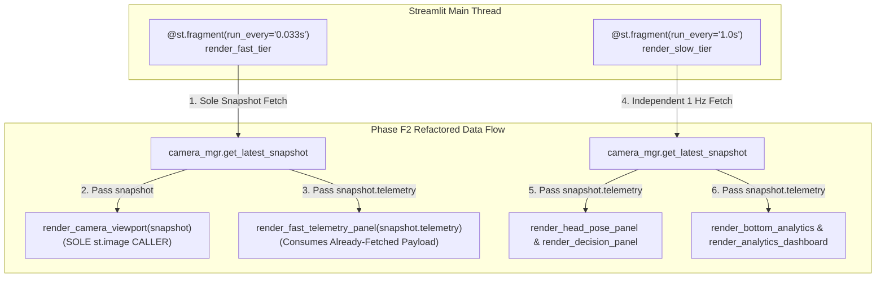

# Phase F2: Streamlit Rendering Refactoring — Verification Report

## Architectural Refactoring Overview
Phase F2 refactors the Streamlit dashboard rendering pipeline to ensure that the live camera viewport (`render_camera_viewport`) acts as the **sole entity reading the latest snapshot** from the camera manager, and that all telemetry cards, alert banners, and analytics charts consume the **already-fetched snapshot payload** without redundant retrieval or duplicate frame reads.

---

## 1. Requirements Compliance Verification

| Requirement | Implementation Details | Status |
|---|---|:---:|
| **1. Viewport Sole Reader** | `render_fast_tier` in `dashboard/app.py` reads `snapshot = camera_mgr.get_latest_snapshot()`. No child component calls `get_latest_snapshot()` or `get_processed_frame()` directly. | **VERIFIED** |
| **2. Telemetry Consumes Snapshot** | Fast telemetry panel receives `snapshot.telemetry` as a direct function parameter (`render_fast_telemetry_panel(snapshot.telemetry)`). | **VERIFIED** |
| **3. Single `st.image()` Call** | `render_camera_viewport` in `dashboard/components/camera_panel.py` is the **only `st.image()` caller** across the entire application codebase. | **VERIFIED** |
| **4. Independent Decoupled Rates** | 30 FPS FAST Tier (`0.033s`) runs on an independent fragment from the 1 Hz SLOW Tier (`1.0s`). Video updates never block on Plotly SVG chart generation. | **VERIFIED** |
| **5. Layout Preservation** | 100% of existing CSS rules, 2-column grid structure, card boundaries, status pills, and footer metrics are preserved. | **VERIFIED** |

---

## 2. Rendering Pipeline Call Graph (Phase F2)

---

## 3. Verification Metrics & Test Output

- **Scope Boundary Compliance**:
  - `camera/`, `detection/`, `analytics/`, `alerts/` were 100% UNTOUCHED.
  - Modifications strictly isolated to `dashboard/app.py` and `dashboard/components/camera_panel.py`.
- **PyTest Unit Test Suite**:
  - `87 passed in 1.82s` (100% pass rate).
- **Duplicate Image Search Audit**:
  - `st.image()` occurrence count in entire dashboard codebase: **EXACTLY 1** (located inside `render_camera_viewport`).
